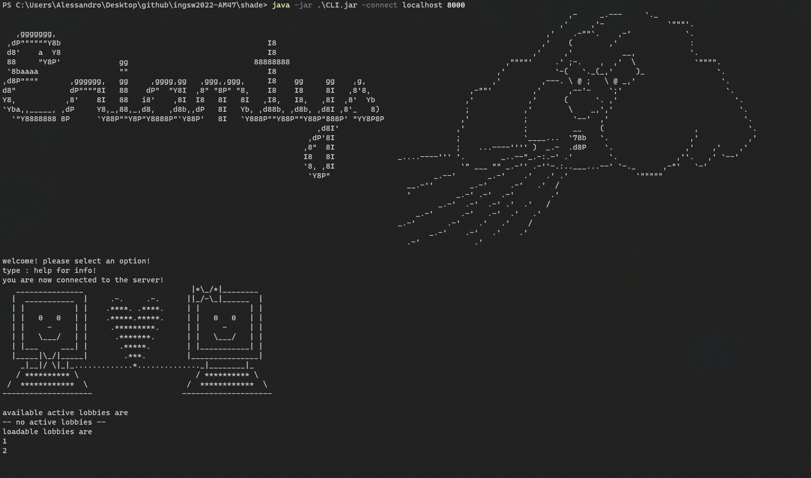
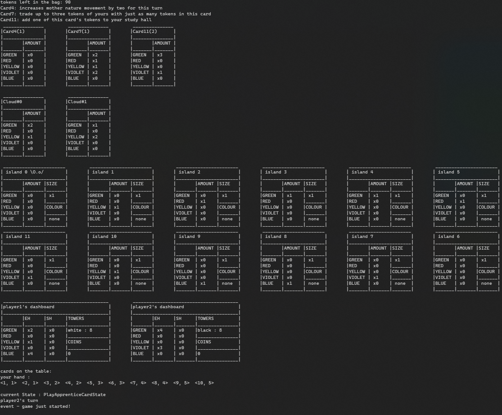
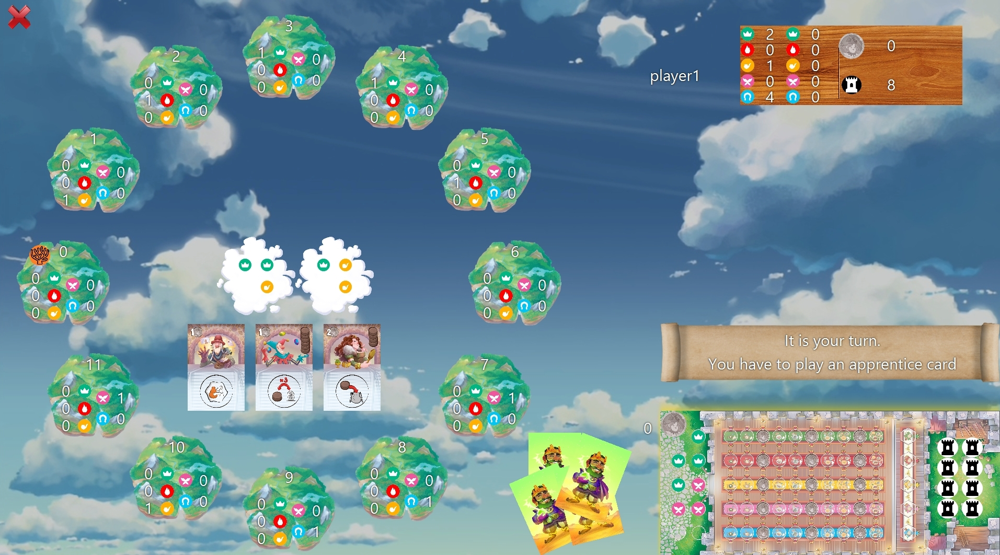

# Prova Finale Ingegneria del Software 2022
## Gruppo AM47

- ###   10617306    Aron Contini ([@contini-aron](https://github.com/contini-aron)) aron.contini@mail.polimi.it
- ###   10679557    Alessandro De Florio ([@Alessandro-DeFlorio](https://github.com/Alessandro-DeFlorio)) alessandro.deflorio@mail.polimi.it
- ###   10739568    Entiol Liko ([@entiolliko](https://github.com/entiolliko)) entiol.liko@mail.polimi.it

## Functionalities

| Functionality    | State |
|:-----------------|:-----:|
| Basic rules               |  🟢   |
| Complete rules            |  🟢   |
| Socket                    |  🟢   |
| GUI                       |  🟢   |
| CLI                       |  🟢   |
| Multiple games            |  🟢   |
| Persistence               |  🟢   |
| 4 players game            |  🟢   |
|Disconnection handling*    |  🟢   |

*: a variant to the proposed advanced feature was implemented

## How to Run

### server
type: java -jar ./server.jar [port] [-purge]

- [port] an optional parameter to specify the preferred server port, otherwise port will be 9001
- [-purge] an option to delete all files in the saves folder (see next warning for further info)

#### warning 
a folder called "saves" should be created into the same folder as the server jar

e.g.

    └── testServerAM47/
        ├── server.jar
        └── saves/
            └── testgame.json
if no such folder is provided before the server is booted up, the program will create the directory by itself 
### CLI
type: java -jar ./CLI.jar [-connect ip port] [-debug]
- [-connect] used to attempt a connection to the server
  - ip: the address of server you want to connect to
  - port: the port of the server you want to connect to
- [-debug] flag to activate debug level of logger

e.g.

    java -jar ./CLI.jar -debug -connect localhost 8000
    java -jar ./CLI.jar -connect localhost 8000 -debug
    java -jar ./CLI.jar -connect 192.168.1.5 9001
    java -jar ./CLI.jar -debug 

#### you can then type help to prompt a legend about the cli and its commands

### GUI
type: java -jar ./GUI.jar

while playing, bear in mind the following:

- the wooden dashboards represent the other players dashboards
  - the tokens on the left represent their entrance hall
  - the tokens on the right represent their study hall
  - if they have a professor, the number of tokens of that colour in their study hall turns yellow
## Test Coverage

| Package    | Class% | Method% | Line% |
|:-----------|:------:|:-------:|:------|
| controller |  100%   |   86%   | 83%   |
| model      |  96%   |   91%   | 90%   |

most of the untested methods in the above-mentioned packages are getters

# GALLERY

### CLI examples

#### welcome screen

#### game example

### GUI example
#### welcome screen

#### game example

🔴
🟢
🟡
